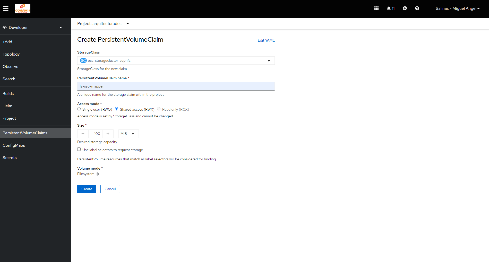

# Descripcion
Documentacion Update Redhat SSO desde 7.4 a 7.6 en Cluster OpenShift de Consum

Los pasos a seguir han sido los siguientes en el proyecto de TEST de Openshift

## STEP01: cliente openshift

Instalar cliente oc en local para poder gestionar los recursos de OpenShift.

- Bajarse el [cliente oc para tu arquitectura](https://access.redhat.com/downloads/content/290). En mi caso el fichero escogido es: **OpenShift v4.11 Linux Client** e instalarlo localmente. El CLI lo instalaré bajo la instancia Ubuntu WSL de Windows 11.

- Login en el cluster Openshift con tus credenciales

```
oc login
```

- Configura Proyecto por defecto para acceder rápidamente a los recursos de la aplicación:

```
oc project arquitecturades
```

## STEP02: Borrar todos los recursos actualmente existentes relacionados con RH-SSO bajo el proyecto Arquitectura Desarrollo (arquitecturades):

Para acceder al Web Admin del cluster de Openshift seleccionaremos la opción Active_Directory_Consum y utilizaremos las credenciales nuestras bajo la organización de consum.

Accedemos al proyecto Arquitectura Desarrollo de OpenShift llamado *arquitecturades* y borramos todos los recursos ya existentes version 7.4 del RH-SSO. Estos recursos son:

- Aplicación asociada al RH-SSO versión 7.4
- Aplicación asociada a la base de datos PostgreSQL del RH-SSO si existiese.
- Volumen de datos asociada a la instancia RH-SSO en donde desplegar los modulos custom del RH-SSO, entre otros el mapper de AGUA. (Opcional)
- Volumen de datos asociada a la base de datos PostgreSQL del RH-SSO si existiese.

Los dos primeros recursos podrán ser borrados directamente desde la vista de aplicaciones del Web Admin del RH-SSO. Los volumenes deberán de ser buscados desde la vista de busqueda de recursos bajo el tipo *persistence volumne claims* (PVC) de OpenShift con el texto *sso* en su interior, veremos que hay dos volumenes uno asociado a PostgreSQL y el otro a la carpeta de despliegues del RH-SSO.

## STEP03: Importar ultimo deployment template para el RH-SSO

Si buscamos la ultima version del RH-SSO veremos que esta es la 7.6.4-GA y que ya existe un deployment template para la misma, de todas formas se baja local este template desde el repo ofical de Redhat en formato json y se importa bajo el repositorio de deployments templates de OpenShift. Tenemos que tener en cuenta que no existe template que solo instancie el RH-SSO y podamos configurar la DB externamente. Por ello instanciaremos la version RH-SSO con PostgreSQL por defecto y despues modificaremos el Deployment Config creado por el template para conectarlo externamente a la DB correspondiente y borraremos finalmente la instancia de PostgreSQL sobrante:


## STEP04: Desplegar el deployment template para el RH-SSO

Ahora vamos a desplegar la nueva instancia para el RH-SSO escogiendo el template recien registrado llamado: Red Hat Single Sign-On 7.6 on OpenJDK + PostgreSQL (Persistent) for OpenShift 4.X. Lo único que debemos tener en cuenta a la hora de desplegar este template en el proyecto de Arquitectura DES es que configuremos:

- **DB Username**: configurar el nombre de usuario de la DB ya desplegada externamente.
- **DB Password**: configurar la password de usuario de la DB ya desplegada externamente.
- **DB Database Name**: configurar el nombre de la base de datos ya desplegada externamente.


Tras unos minutos las dos aplicaciones estarán desplegas bajo el nombre sso y sso-postgresql


**Nota**: la URL de la DB no se puede configurar gráficamente, pues RH-SSO utiza jdni para definir el Datasource(username, password, db y url). Debemos de desplegar el RH-SSO localmente con la DB y despues modificar el Deployment Config creado y añadir una variable de entorno que sobrescriba la configuración del jdni anterior.

## STEP05: Crear un nuevo volumen para los mappers

Debemos de crear un nuevo persistence volume claim para crear un volumen atachado a nuestra instancia de RH-SSO en donde guardar los custom mappers. Para ello accedemos a la opción de Search del Web Admin y buscamos recursos de tipo Persistence Volume Claim (PVC) y creamos este recurso con estas características:



Una vez creado se pueden ver el nuevo volume creado bajo la lista del proyecto


## STEP06: Reconfigurar la aplicación del SSO

Ahora que tenemos la aplicación del SSO instanciada y el PVC creado vamos a configurar dos cosas en el DeploymentConfig creado por el Template recien desplegado:

- Añadir la variable de entorno llamada **SSO_POSTGRESQL_SERVICE_HOST**, esta variable de entorno permite configurar la IP de la base de datos externa donde está corriendo la DB PostgreSQL de RH-SSO con el schema de la antigua versión 7.4.

- Atachar el volumen llamado **fs-sso-mapper** antes creado bajo el path **/opt/eap/standalone/deployments** que es donde RH-SSO desplegara los nuevos custom mappers encontrados en esta carpeta. 

Aqui podemos ver la nueva variable de entorno definida en el DeploymentConfig desde el Admin Web:


Aqui se puede ver como se configura el nuevo volume claim en el DeploymentConfig:


Y aqui como se utilizar ese PVC para ser para ser atachado al contenedor del POD del RH-SSO en el path correspondiente


Una vez modificado el DeploymentConfig se guarda y tras unos segundos la instancia hace un redespliegue y por un lado se conecta ahora a la nueva DB que comenzará a actualizar el schema de la versión 7.4 a la versión 7.6 del nuevo RH-SSO correctamente y al mismo tiempo se crea un volumen generado por el PVC atachado al path correspondinte como se puede ver en los nuevos recursos del POD del template:


## STEP07: Desplegar los custom mappers en el volumen

Ahora ya con la nueva instancia desplegada del RH-SSO conectada al nueva DB de PostgreSQL y con el volumen desplegado y atachado correctamente a la instancia. Solo nos queda desplegar los custom mappers que debemos desplegar en la nueva instancia. Estos son:

- agua-protocol-mapper-v1.1.0.jar: custom mapper para conectarse al microservicio de AGUA encargado de recuperar los roles dado un id de usuario e injectarlos en el JWT emitido por el RH-SSO
- impersonate-protocol-mapper.jar: custom mapper para gestionar la impersonación de usuarios

Para ello debemos de recuperar estos recursos (jars) de la instancia de RH-SSO desplegada en el proyecto de TEST del cluster a local y despues subir los mismos al entorno de DES en la nueva instancia RH-SSO version 7.6. Usaremos el CLI de oc de OpenShift para ello:

Para recuperar los recursos de la instancia de TEST debemos primero colocarnos en este proyecto y bajarnos los recursos a local como sigue, utilizando como origen el nombre del POD de la aplicación del RH-SSO del proyecto TEST

```
oc proyecto arquitecturatest
oc rsync sso-11-xnw5b:/opt/eap/standalone/deployments ./
```

Despues de bajarnos los recursos a local, debemos de borrar los ficheros temporales con extensión deployed, pues son ficheros temporales creados por el servidor de aplicacioens del RH-SSO que serán creados despues tras el despliegue y por ello no deben de subirse a la nueva instancia del RH-SSO de Desarrollo.

Ahora subimo estos recursos (los dos jars antes descritos) de local al volumen de la nueva instancia RH-SSO, debemos de utillizar el nombre del POD y poner la capeta de destino correspondiente en donde queremos guardar estos recursos como sigue:

```
oc rsync . sso-3-mcdhb:/opt/eap/standalone/deployments
```

Tras unos segundos y si nos conectamos por el terminal al POD y vamos a esta carpeta de despliegue veremos que aparcen dos ficheros temporales que indican que se han desplegado los jars correctamente y ya estan disponibles para ser utilizados. Tambien podemos consultar los logs del POD si fuera necesario.

## STEP08: Borrar la instancia de PostgreSQL desplegada localmente en el proyecto Arqwuitectura Desarrollo

Ya que vamos a utilizar una instancia de DB externa al cluster de Openshift, la instancia desplegda por defecto por el template no va a ser utilizada, por lo que podemos eliminarla y liberar recursos en el cluster de OpenShift.

## STEP09: Chequeo de la nueva instancia RH-SSO desde el Web Admin:

Ahora que ya esta la nueva instancia actualizada a la version 7.6 con la base de datos PostgreSQL desplegada externamente con el schema ya actualizado y con los mappers custom desplegados correctamente, vamos a conectarnos a la Web Admin del RH-SSO y ver que todo esta correcto. Para conectarnos podemos coger las credenciales de Administrador que pueden ser consultadas en las variables de entorno generadas por la instancia.

Una prueba que podemos hacer es visualizar el cliente WEB_APP por ejemplo y ver si dentro de los mappers configurados aparece el de AGUA:


Se puede ver como esta registrado, configurado y listo para ser utilizado por el SSO cuando intentemos emitir un token al aute

## STEP10: Pruebas end-to-end con la nueva instancia:

Finalmente vamos a realizar una prueba end-to-end para ver que el sistema emite Tokens y este inyecto los roles del usuario procedentes de AGUA utilizando el custom mapper desplegado en el RH-SSO. Ejecutamos una petición curl como esta:


```
curl --location 'https://sso-arquitecturades.opsdev.consum.es/auth/realms/test/protocol/openid-connect/token' \
--header 'Content-Type: application/x-www-form-urlencoded' \
--header 'Cookie: 33420d2c1a70acbb5a98bc5413af6ebf=cddedd34e544ff4275462f40c9903207' \
--data-urlencode 'client_id=WEB_APP' \
--data-urlencode 'client_secret=5fd91a85762f4a7fb5ee3fc8fb648e1a' \
--data-urlencode 'grant_type=password' \
--data-urlencode 'username=<USER_NAME>' \
--data-urlencode 'password=<USER_PASSWORD>

```

Y el resultado de la misma parece correcta.


Pero viendo en detalle el token emitido por RH-SSO, inspeccionamos el JWT obtenido podremos ver como correctamente bajo el claim de authorities exiten los roles que han sido definidos en AGUA para el usuario autenticado, por lo que podemos concluir que la nueva instancia de RH-SSO version 7.6.4 GA con los custom mappers funciona correctamente

